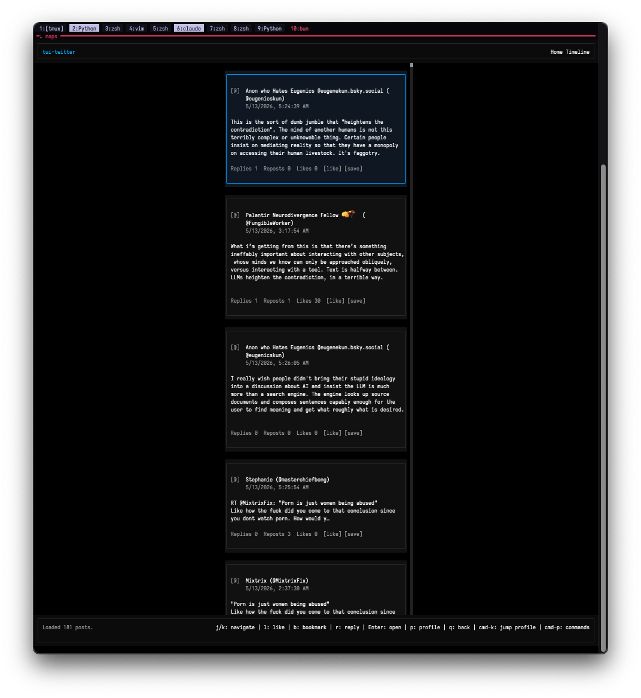
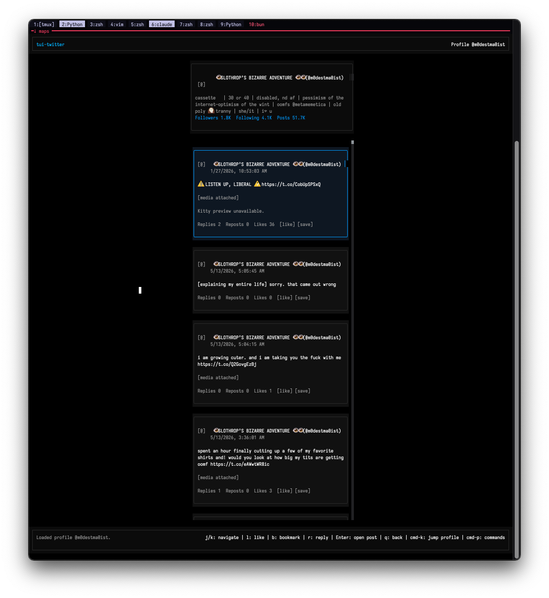

# tui-twitter

Terminal UI client for Twitter/X. Interactive timeline browser plus a headless CLI for scripted posting, replies, and bookmark management.

Auth uses cookie extraction from your live browser session — no OAuth app credentials required.





---

## Install

### Prerequisites

- [Bun](https://bun.sh/) — `curl -fsSL https://bun.sh/install | bash`
- A logged-in session in Firefox or Chrome (default profiles work out of the box)
  — or explicit `AUTH_TOKEN` + `CT0` values if you prefer manual config

### Setup

```bash
git clone git@github.com:nosleepcassette/tui-twitter.git
cd tui-twitter
bun install
cp .env.example .env
```

Edit `.env` if you want to hardcode tokens. Otherwise leave it blank and let the tool extract cookies from your browser automatically.

```bash
bun link          # installs tui-twitter to your PATH
tui-twitter       # launch the TUI
```

---

## Auth

tui-twitter resolves credentials in this order:

1. **Env vars** — `AUTH_TOKEN` + `CT0` (or `TWITTER_AUTH_TOKEN` + `TWITTER_CT0`)
2. **Firefox** — default-release profile, auto-discovered
3. **Chrome** — Default profile, auto-discovered

Both `auth_token` and `ct0` are required. If your browser session is active, no manual setup is needed — just launch the tool and it will find them.

### Optional env vars

```bash
TWITTER_FIREFOX_PROFILE=default-release   # use a specific Firefox profile folder name
TWITTER_CHROME_PROFILE=Profile 1          # use a specific Chrome profile folder name
TWITTER_ALLOW_FIREFOX=true                # set false to skip Firefox extraction
TWITTER_ALLOW_CHROME=true                 # set false to skip Chrome extraction
X_IMAGE_MODE=auto                         # auto | kitty | off — inline image rendering
```

---

## TUI Mode

Launch with no arguments:

```bash
tui-twitter
```

Opens the home timeline. All navigation is keyboard-driven.

### Keybindings

| Key | Action |
|-----|--------|
| `j` / `↓` | Move selection down |
| `k` / `↑` | Move selection up |
| `Enter` | Open post detail / conversation thread |
| `r` | Reply to selected post |
| `l` | Like / unlike selected post |
| `b` | Bookmark / unbookmark selected post |
| `p` | Open author profile |
| `B` | Open bookmarks view |
| `cmd-k` | Jump to any profile by username |
| `cmd-p` | Command palette |
| `q` | Go back / exit |
| `ctrl-c` | Quit |

The compose input (triggered by `r` or via command palette) supports up to 280 characters. Press `Enter` to post.

---

## CLI Mode — Automated Posting

All posting flags bypass the renderer entirely. No TUI window opens.

### A note on automation detection

X/Twitter aggressively monitors for automated posting patterns. If you post exclusively through the CLI without any prior interactive activity, your session may be flagged, rate-limited, or silently fail.

**The workaround:** make at least one manual post before a scripted run. This can be via the TUI (`tui-twitter`, navigate to compose, post something), or directly on twitter.com. Warming the session like this resets X's automation heuristics for that cookie session.

For scheduled posts (cron jobs, agent workflows), the recommended pattern is:

1. Launch `tui-twitter` in TUI mode at least once per day and interact briefly
2. Run your automated posts within the same session window
3. If a CLI post returns an unexpected error, open the TUI, make one manual post, then retry

### Query ID freshness

X's internal GraphQL query IDs rotate periodically. If posting stops working, refresh them:

```bash
bun run query-ids:update
```

---

## CLI Reference

### Post a tweet

```bash
tui-twitter --post "your tweet text here"
```

Output:
```
[auth] Using Twitter session from Firefox (default-release).
Tweet posted: https://x.com/nosleepcassette/status/1234567890123456789
```

### Post with an image

```bash
tui-twitter --post "shipping something new" --image ./screenshot.png
```

Supported formats: JPEG, PNG, GIF, WEBP. Max file size follows X's media upload limits (~5MB for images).

```bash
# Full path works too
tui-twitter --post "morning light" --image /Users/maps/Photos/2026-05-13.jpg
```

### Reply to a tweet

Grab the tweet ID from the URL (`x.com/username/status/TWEET_ID`) or from a `--json` output.

```bash
tui-twitter --post "agreed, actually" --reply-to 1234567890123456789
```

Output:
```
Reply posted: https://x.com/i/web/status/9876543210987654321
```

### Reply with an image

```bash
tui-twitter --post "here's what I'm seeing" \
  --reply-to 1234567890123456789 \
  --image ./screenshot.png
```

### List bookmarks

```bash
tui-twitter --bookmarks
```

```bash
tui-twitter --bookmarks --max 50
```

### Bookmarks as JSON (for scripting)

```bash
tui-twitter --bookmarks --json
```

```json
{
  "items": [
    {
      "id": "1234567890123456789",
      "text": "...",
      "author": "username",
      "name": "Display Name",
      "createdAt": "2026-05-12T14:30:00.000Z"
    }
  ],
  "nextToken": "...",
  "count": 20
}
```

### Bookmark / unbookmark a post

```bash
tui-twitter --bookmark 1234567890123456789
tui-twitter --unbookmark 1234567890123456789
```

### JSON output for any command

`--json` emits structured output for all commands. Useful for piping into other tools.

```bash
tui-twitter --post "hello world" --json
tui-twitter --bookmark 1234567890123456789 --json
```

### Help

```bash
tui-twitter --help
```

---

## Automation Examples

### Shell script — post a daily log

```bash
#!/usr/bin/env zsh
# post-daily.zsh
# Run after a manual TUI session to stay warm

MESSAGE="daily log $(date +%Y-%m-%d): $1"
tui-twitter --post "$MESSAGE"
```

```bash
./post-daily.zsh "shipped augury 1.2.0, fixed card picker, no longer haunted"
```

### Post an image from a pipeline

```bash
#!/usr/bin/env zsh
# Render something, post it
OUTFILE="/tmp/render-$(date +%s).png"
python3 ~/dev/myproject/render.py --output "$OUTFILE"
tui-twitter --post "new render, $(date +%Y-%m-%d)" --image "$OUTFILE"
rm "$OUTFILE"
```

### Agent-driven posting (from another script or agent)

```bash
# Hermes or any shell-capable agent can call this directly:
tui-twitter --post "$(cat /tmp/agent-draft.txt)"
```

### Scheduled cron post with warm-session guard

```bash
# crontab example — post at 9am daily
# Assumes you've opened the TUI at least once today
0 9 * * * cd ~/dev/tui-twitter && /Users/maps/.bun/bin/bun src/index.ts \
  --post "$(cat ~/posts/scheduled.txt)" >> ~/logs/tui-twitter.log 2>&1
```

### Bookmark a tweet then post a reply

```bash
TWEET_ID="1234567890123456789"
tui-twitter --bookmark "$TWEET_ID"
tui-twitter --post "saving this and also: yes" --reply-to "$TWEET_ID"
```

### Pipe bookmarks to a script

```bash
# Get first bookmark ID
FIRST_ID=$(tui-twitter --bookmarks --json | jq -r '.items[0].id')
echo "Most recent bookmark: $FIRST_ID"
```

---

## Known Issues

### CreateTweet response parsing (`--post` returning no tweet ID)

X occasionally changes the GraphQL response shape for the `CreateTweet` mutation. If `--post` fails with `"Tweet created but no tweet ID was returned"`, the tweet may have still gone through — check your profile.

Fixes in priority order:
1. Run `bun run query-ids:update` to refresh the query ID
2. Open the TUI, make one manual post, then retry the CLI command
3. Check `src/api/query-ids.json` — the `CreateTweet` query ID may need a manual update

---

## Project Structure

```
src/
  index.ts          CLI entrypoint + argument parser
  config.ts         Env var loading and auth config
  types.ts          Shared types (ExpandedPost, XUser, etc.)
  api/
    client.ts       XApiClient — all GraphQL calls
    posts.ts        createPost, replyToPost
    timeline.ts     Home timeline, user timelines
    bookmarks.ts    Bookmark CRUD
    users.ts        User lookup
    likes.ts        Like/unlike
  auth/
    cookie-session.ts   Session management + refresh
    browser-cookies.ts  Firefox/Chrome cookie extraction
  ui/
    app.ts          TuitterApp — view stack, keybinding dispatch
    views/          Timeline, PostDetail, Compose, Bookmarks, Profile, QuickActions
    components/     PostCard, HeaderBar, StatusBar, UserInfo
    media/          Kitty graphics protocol, inline image manager
scripts/
  update-query-ids.ts   Refreshes src/api/query-ids.json from live X JS bundles
```

---

## Updating Query IDs

X rotates internal GraphQL query IDs. When any endpoint breaks:

```bash
bun run query-ids:update
```

This fetches fresh IDs from X's JavaScript bundles and writes them to `src/api/query-ids.json`. If this script itself breaks, the query IDs can be extracted manually from browser devtools (Network tab → filter for `graphql` → copy the `queryId` field).

---

## License

MIT — maps · cassette.help
